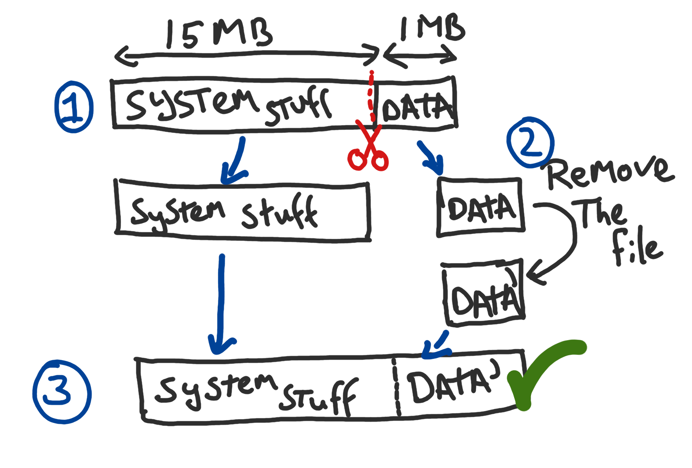

# Redemption

In the final moments before recording our demo, an undisclosed member of our team copied a large file to the camera. This stopped the camera from booting. With our only development interface being `telnet`, the camera seemed beyond saving.


## Attempt 1; UART

I first turned to UART for help. A lot of embedded devices will have a root shell waiting on the UART port. On our model, the UART port uses two test pads near the CPU. I soldered two jumper wires to the test pads and added a wire for ground.  
   
Next, I used a serial adapter set to 3.3v (**Measure the test pads with a multimeter!**) and opened the connection in `picocom`. Sadly, the output stops after `U-Boot` starts the kernel. I tried to edit the `bootargs` variable, but was not able to get a shell.  

## Attempt 2; Crafting an update

U-Boot also comes with an update mechanism that would allow me to flash a new image file. This method proved to be _way_ to difficult, because:  
1. The updates published by the manufacturer don't contain the affected partition
1. Our camera doesn't have usb or ethernet to easily flash the file.

I Ultimately don't know enough about U-Boot to fix either of these issues.

## The solution

In the end, everything is "just" data. So why can't I just dump the flash, patch it, and flash it to the camera?  
  
Here is the game-plan to unbrick our camera:  


### (1) Separating the faulty partition
#### Gathering information

The first step is to find the affected partition. This can be done through U-Boot:
1. Connect both UART and usb power to the camera.
1. Reconnect both connections, quickly open a serial connection and press `CTRL-C` to stop the boot process.
1. Look for a line detailing the partition sizes.

```
bootargs=mem=64M gmmem=34M console=ttyS0,115200 user_debug=31 init=/squashfs_init
   root=/dev/mtdblock2 rootfstype=cramfs mtdparts=norflash:512K(boot),1856K(kernel),
   4672K(romfs),5248K(user),2048K(web),1024K(custom),1024K(mtd)
```
As a quick check, these numbers add to 16 MB, the exact size of our flash chip.  
The faulty partition is the `mtd` partition, starting at 15 MB.

#### Dumping the flash

Time to crack the camera open again. To dump the flash I used a SOP8 test clip, clamped over the chip. The flash can be dumped to a binary file using `flashrom`:  
```bash
flashrom --programmer ch341a_spi -r dump.bin
```

This takes a little over five minutes to complete. Be sure not to disturb the camera.

#### Cutting out the partition
Now the partition can be isolated from the flash dump using the following command.
```bash
dd if=dump.bin of=jff2.bin bs=1M skip=15
```

### (2) Removing the file

Before the jffs2 partition can be mounted, some packages and modprobes need to be present. These are the requirements for Ubuntu 19:  
```bash
apt-get install mtd-utils
modprobe jffs2
modprobe mtdram
modprobe mtdblock
```
The next step is to mount the partition. It takes a little extra effort, because jffs2 partitions require a block device.
```bash
mknok /dev/mtdblocktest -b 31
dd if=jff2.bin of=/dev/mtdblocktest
mkdir tmp_part
mount -t jffs2 /dev/mtdblocktest tmp_part
```
Now you can simply remove the file from the tmp_part to free some space. When you are done, use the following commands to unmount and save the patched partition.
```bash
umount tmp_part
dd if=/dev/mtdblocktest of=jffs2patched.bin bs=1M count=1

```
### (3) Combining the partitions
The final step is to mix both binaries together:
```bash
(dd if=dump.bin bs=1M count=15 && dd if=jffs2patched.bin bs=1) > patched.bin
```

### Writing the binary

Time to bust out the trusty SOP8 clip again, mount it to the memory chip and use `flashrom` to write the file.
```bash
flashrom --programmer ch341a_spi -w patched.bin
```
After about 10 minutes, the programmer should have finished writing the binary. Now you can disconnect the clip, and plug in the camera. If all went well, you will be greeted with a cheerful _"Camera Ready!"_
  
At this point the camera can be reassembled, and live happily ever after.  
  
  
 \- Rick
